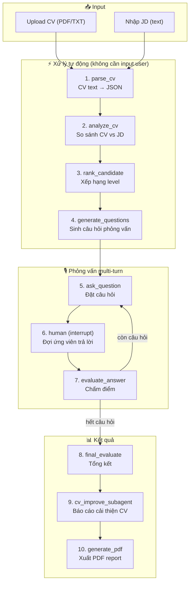

# CVHR — Chat Flow Documentation

## Tổng quan luồng chat

## Chi tiết từng bước

### Bước 1: Parse CV (`node_parse_cv`)
- **Input:** `cv_raw_text` (text thô từ PDF)
- **Output:** `cv_structured` (JSON), `field_category`
- **Mô tả:** LLM đọc CV text thô và trích xuất thành JSON có cấu trúc

### Bước 2: Phân tích CV (`node_analyze_cv`)
- **Input:** `cv_structured`, `jd_text`
- **Output:** `strengths`, `weaknesses`, `skill_match_score`, `cv_improvements`
- **Mô tả:** So sánh CV với JD, đánh giá mức độ phù hợp

### Bước 3: Xếp hạng (`node_rank_candidate`)
- **Input:** `cv_structured`, `jd_text`
- **Output:** `candidate_rank`, `rank_reasoning`, `years_of_experience`
- **Mô tả:** Xếp hạng level (Fresher → Lead) dựa trên kinh nghiệm

### Bước 4: Sinh câu hỏi (`node_generate_questions`)
- **Input:** `cv_structured`, `jd_text`, `candidate_rank`, `weaknesses`
- **Output:** `questions` (5-7 câu), `current_q_index = 0`
- **Mô tả:** Sinh bộ câu hỏi phỏng vấn phù hợp level

### Bước 5-7: Vòng lặp phỏng vấn
- `node_ask_question` → Hiển thị câu hỏi
- `node_human` → `interrupt()` đợi ứng viên trả lời
- `node_evaluate_answer` → Chấm điểm, tăng `current_q_index`
- **Conditional edge:** Nếu còn câu hỏi → quay lại Bước 5

### Bước 8: Tổng kết (`node_final_evaluate`)
- **Output:** `overall_score`, `final_verdict` (PASS/CONSIDER/FAIL)

### Bước 9: Cải thiện CV (`node_cv_improve_subagent`)
- **Output:** `cv_improve_report` (Markdown roadmap 5 phần)

### Bước 10: Xuất PDF (`node_generate_pdf`)
- **Output:** `pdf_path` (Phase 3)

## Conditional Edges

| Edge | Hàm routing | Logic |
|------|-------------|-------|
| `human` → ? | `route_after_human` | `cv_improve_active` ? → subagent : → evaluate |
| `evaluate_answer` → ? | `route_after_evaluate` | `current_q_index < len(questions)` ? → ask : → final |
